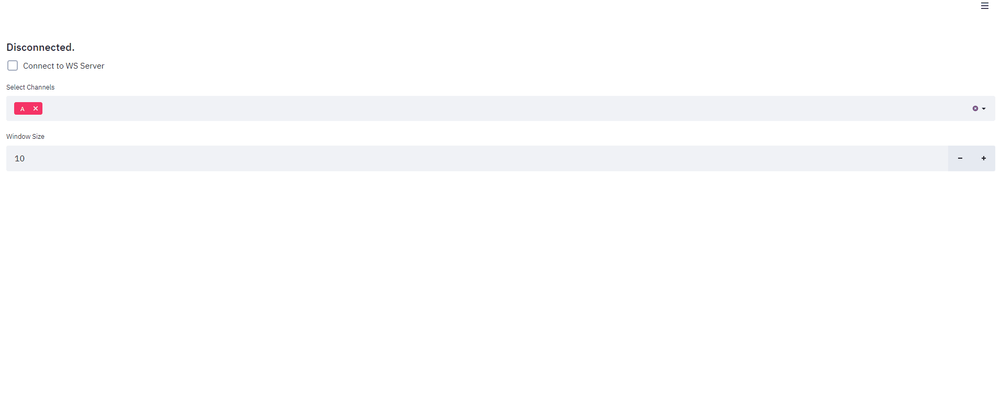

## Streamlit Streaming

A template to create applications that consume from a stream.

This template consumes from a websocket stream but it can be anything, a messaging queue ( mqtt, amqp etc.), or any async generatior.

#### How to run ?

Clone the repo and

```
docker-compose up
```

And you are done.



#### For non-docker people

```
pip install -r requirements.txt
```

In producer directory:

```
cd producer
uvicorn main:app --port 8000
```

In consumer/src directory:

```
cd consumer
cd src

streamlit run main.py
```


